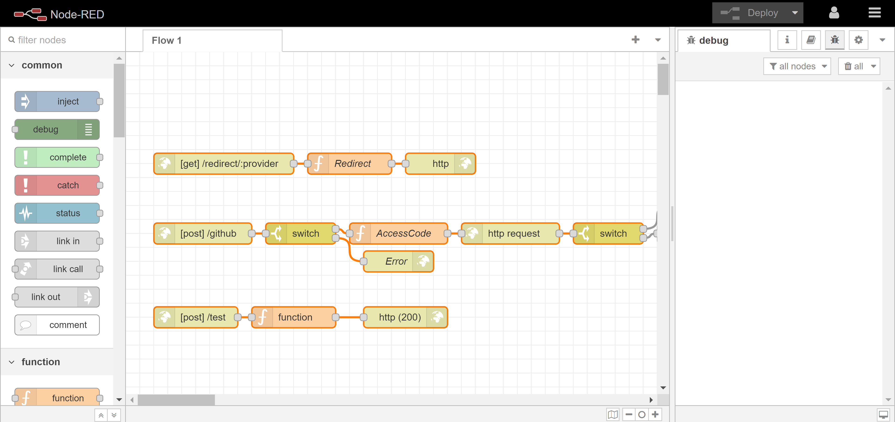

# Boba ID Server


## How it Works
The BobaID Server is based on Nodered for ease of management. If you're having difficulties, try using the inject/debug node to see what each node is outputting. [Learn more](https://www.youtube.com/watch?v=taqQ0T_ZJSM). This is easily hostable locally or on a decentralized cloud server, which is much better than using AWS lambda or something.

This is the server that the Turing endpoint interacts with. There are 3 endpoints currently

### Redirect

For web apps that use the # character to build virtual pages (such as the BobaID UI), oAuth servers won't redirect correctly. Use this server endpoint instead. It will redirect from http://boba-id-server.com/redirect/github to http://boba-id-ui.com/#/github?state=state&code=code while maintaining the query parameters

### The Provider (Github) Endpoint

This is the endpoint Turing interacts with. It should be mostly the same to implement other oAuth providers, but so far only Github has been implemented. 

First it will check that the caller is our TuringHelper contract. Assuming it is, it accepts the `code` aka our authorization code from the smart contract and decodes it. This is used in our `POST` request to the provider's server, where we will get the access token.

With the access token, it can retrieve the user's account data. This is then encoded and sent back to the smart contract.

### Test Endpoint

For testing. 

## Server Setup (/server)

After git clone, modify the .env.example file with your own values and rename it to .env

```
npm install
```

```
sudo docker run -d -p 1880:1880 --env-file .env -v /server:/data --name BobaIDServer nodered/node-redname
```
